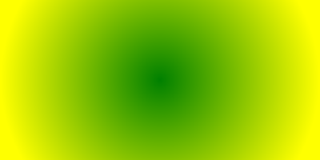
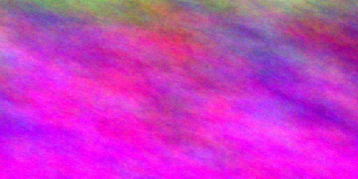
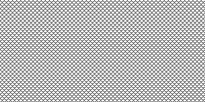

# Image placeholder provider for [Faker](https://github.com/FakerPHP/Faker)

A high-performance placeholder image generator with full test coverage and no network requests to third-party services.


## Installation

Install this Faker [provider](https://fakerphp.org/#faker-internals-understanding-providers) using [Composer](https://getcomposer.org/):
```shell
composer require niklasbr/quick-magick
```


## Example usage

```php
use Faker\Factory;
use NiklasBr\QuickMagick\QuickMagick;

$faker = Factory::create();
$faker->addProvider(new QuickMagick($faker));
```
```php
// Simple image with only default parameters
$imageData = $faker->image();
```


```php
// A linear gradient
$imageData = $faker->image(category: Type::LINEAR_GRADIENT, word: '#1100ff-magenta');
```


```php
// A radial gradient
$imageData = $faker->image(category: Type::RADIAL_GRADIENT, word: 'green-yellow');
```


```php
// A plasma with fractal colour
$imageData = $faker->image(category: Type::PLASMA, word: 'fractal-magenta');
```


```php
// A black and white pattern
$imageData = $faker->image(category: Type::PATTERN, imagickArgs: 'SMALLFISHSCALES');
```



## License

This package is available under two licenses:

- [Affero GPL Version 3, 19 November 2007](LICENSE-AGPL-3.0.md), this is the default license.

- [BSD-3.0 via commercial agreement](LICENSE-Commercial.md) which also includes a limited warranty and fitness-for-purpose promise, available upon donation to charity.
