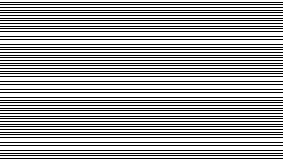
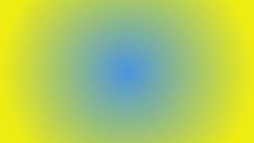
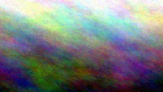

# Documentation

This document explains how to use QuickMagick’s public methods and what the main input arguments mean. The sections below describe the most commonly used arguments across those methods.

QuickMagick is intended to be used as a Faker provider. Register `new QuickMagick($faker)` with Faker once, and the generated examples below assume the provider is already available on `$faker`.

## `dir` and `filePath`

- `dir` is the target directory where generated image files are written. If omitted, QuickMagick defaults to the system temporary directory.
- `filePath` is the explicit destination path for the generated image. Use this when you need full control over the output filename.

Methods using `dir` include `image()`, `randomSolidColor()`, `randomGradient()`, `randomPattern()`, `randomPlasma()`, and `randomImage()`.

## `width` and `height`

These arguments define the output image dimensions in pixels. Every public image generation method accepts both `width` and `height`.

- `width` controls the horizontal size.
- `height` controls the vertical size.

Use smaller values for lightweight placeholder images and larger values for high-resolution examples.

## `category`

The `category` argument controls the image type and the pseudo-image syntax used by ImageMagick.

QuickMagick accepts:

- a `Category` enum value like `Category::LINEAR_GRADIENT`
- an enum name like `'LINEAR_GRADIENT'`
- a category string value like `'gradient'`

Supported categories include:

- `Category::SOLID_COLOR`
- `Category::LINEAR_GRADIENT`
- `Category::RADIAL_GRADIENT`
- `Category::PATTERN`
- `Category::PLASMA`
- `Category::LABEL`
- `Category::CAPTION`

If `category` is omitted, it defaults to `Category::SOLID_COLOR`.

## `word`

The `word` argument is category-specific and supplies the core pseudo-image parameter.

- `Category::SOLID_COLOR` — a single color such as `#2E86AB`.
- `Category::LINEAR_GRADIENT` and `Category::RADIAL_GRADIENT` — a color pair separated by a hyphen, e.g. `#667EEA-#764BA2`.
- `Category::PATTERN` — a pattern token such as `CROSSHATCH30` or `SMALLFISHSCALES`.
- `Category::PLASMA` — an optional seed color like `#FF006E`; omitting `word` produces a random plasma.
- `Category::LABEL` and `Category::CAPTION` — plain text to render in the image.

ImageMagick supports many color notations, including `#f09`, `#FFBBEE01`, `rgb(255,0,153)`, `rgba(123,123,123,0.1)`, and `hsl(80,10%,42%)`.

## `gray`

The `gray` argument is a boolean flag available on `image()`, `imageData()`, and `createImageFile()`.

When `true`, the generated image is converted to grayscale after rendering.

## `format`

The `format` argument controls the output image format.

Supported formats are defined in `NiklasBr\QuickMagick\Enums\Format`:

- `Format::PNG`
- `Format::JPEG`
- `Format::GIF`
- `Format::WEBP`
- `Format::TIFF`
- `Format::BMP`

Use these constants to ensure consistent output across your calls.

## `fullPath` and `randomize`

These arguments apply to `image()`:

- `fullPath` determines whether the method returns the full path (`true`) or just the file name (`false`).
- `randomize` controls whether the generated filename is unique. Set it to `false` for stable names, or `true` to avoid collisions.

## Convenience random methods

QuickMagick also exposes convenience methods for generating random placeholder content:

- `randomSolidColor()`
- `randomGradient()`
- `randomPattern()`
- `randomPlasma()`
- `randomImage()`

These methods accept `dir`, `width`, `height`, and `format`, and they generate images without requiring you to provide a `category` or `word` value.

# Example images and generation arguments

This file lists the arguments used to generate each example image with QuickMagick.

## solid_color.png
Solid color canvas - A simple teal blue background

<table><tr><td style="width: 400px;">Preview</td><td>Generation</td></tr>
<tr><td style="width: 400px;"></td><td style="width: 420px;"><pre><code class="language-php">$faker->image(&#10;    dir: __DIR__ . '/img',&#10;    width: 320,&#10;    height: 180,&#10;    category: Category::SOLID_COLOR,&#10;    word: '#2E86AB',&#10;    format: Format::PNG&#10;);</code></pre></td></tr></table>

## linear_gradient_purple.png
Linear gradient - Purple to indigo vertical transition

<table><tr><td style="width: 400px;">Preview</td><td>Generation</td></tr>
<tr><td style="width: 400px;"></td><td style="width: 420px;"><pre><code class="language-php">$faker->image(&#10;    dir: __DIR__ . '/img',&#10;    width: 320,&#10;    height: 180,&#10;    category: Category::LINEAR_GRADIENT,&#10;    word: '#667EEA-#764BA2',&#10;    format: Format::PNG&#10;);</code></pre></td></tr></table>

## linear_gradient_pink.png
Linear gradient - Pink to coral vertical transition

<table><tr><td style="width: 400px;">Preview</td><td>Generation</td></tr>
<tr><td style="width: 400px;"></td><td style="width: 420px;"><pre><code class="language-php">$faker->image(&#10;    dir: __DIR__ . '/img',&#10;    width: 320,&#10;    height: 180,&#10;    category: Category::LINEAR_GRADIENT,&#10;    word: '#F093FB-#F5576C',&#10;    format: Format::PNG&#10;);</code></pre></td></tr></table>

## linear_gradient_cyan.png
Linear gradient - Sky blue to cyan vertical transition

<table><tr><td style="width: 400px;">Preview</td><td>Generation</td></tr>
<tr><td style="width: 400px;"></td><td style="width: 420px;"><pre><code class="language-php">$faker->image(&#10;    dir: __DIR__ . '/img',&#10;    width: 320,&#10;    height: 180,&#10;    category: Category::LINEAR_GRADIENT,&#10;    word: '#4FACFE-#00F2FE',&#10;    format: Format::PNG&#10;);</code></pre></td></tr></table>

## radial_gradient_sunset.png
Radial gradient - Red to golden yellow circular transition

<table><tr><td style="width: 400px;">Preview</td><td>Generation</td></tr>
<tr><td style="width: 400px;"></td><td style="width: 420px;"><pre><code class="language-php">$faker->image(&#10;    dir: __DIR__ . '/img',&#10;    width: 320,&#10;    height: 180,&#10;    category: Category::RADIAL_GRADIENT,&#10;    word: '#FF6B6B-#FFE66D',&#10;    format: Format::PNG&#10;);</code></pre></td></tr></table>

## radial_gradient_peachy.png
Radial gradient - Mint to peachy circular transition

<table><tr><td style="width: 400px;">Preview</td><td>Generation</td></tr>
<tr><td style="width: 400px;"></td><td style="width: 420px;"><pre><code class="language-php">$faker->image(&#10;    dir: __DIR__ . '/img',&#10;    width: 320,&#10;    height: 180,&#10;    category: Category::RADIAL_GRADIENT,&#10;    word: '#95E1D3-#F38181',&#10;    format: Format::PNG&#10;);</code></pre></td></tr></table>

## plasma_electric_blue.png
Plasma effect - Electric blue fractal pattern

<table><tr><td style="width: 400px;">Preview</td><td>Generation</td></tr>
<tr><td style="width: 400px;"></td><td style="width: 420px;"><pre><code class="language-php">$faker->image(&#10;    dir: __DIR__ . '/img',&#10;    width: 320,&#10;    height: 180,&#10;    category: Category::PLASMA,&#10;    word: '#0061FF',&#10;    format: Format::PNG&#10;);</code></pre></td></tr></table>

## plasma_vibrant.png
Plasma effect - Bold magenta to orange fractal

<table><tr><td style="width: 400px;">Preview</td><td>Generation</td></tr>
<tr><td style="width: 400px;"></td><td style="width: 420px;"><pre><code class="language-php">$faker->image(&#10;    dir: __DIR__ . '/img',&#10;    width: 320,&#10;    height: 180,&#10;    category: Category::PLASMA,&#10;    word: '#FF006E-#FB5607',&#10;    format: Format::PNG&#10;);</code></pre></td></tr></table>

## pattern_crosshatch.png
Pattern - Crosshatch texture

<table><tr><td style="width: 400px;">Preview</td><td>Generation</td></tr>
<tr><td style="width: 400px;"></td><td style="width: 420px;"><pre><code class="language-php">$faker->image(&#10;    dir: __DIR__ . '/img',&#10;    width: 320,&#10;    height: 180,&#10;    category: Category::PATTERN,&#10;    word: 'CROSSHATCH30',&#10;    format: Format::PNG&#10;);</code></pre></td></tr></table>

## pattern_fishscales.png
Pattern - Small fish scales texture

<table><tr><td style="width: 400px;">Preview</td><td>Generation</td></tr>
<tr><td style="width: 400px;"></td><td style="width: 420px;"><pre><code class="language-php">$faker->image(&#10;    dir: __DIR__ . '/img',&#10;    width: 320,&#10;    height: 180,&#10;    category: Category::PATTERN,&#10;    word: 'SMALLFISHSCALES',&#10;    format: Format::PNG&#10;);</code></pre></td></tr></table>

## label_text.png
Label - Simple text rendering on solid background

<table><tr><td style="width: 400px;">Preview</td><td>Generation</td></tr>
<tr><td style="width: 400px;"></td><td style="width: 420px;"><pre><code class="language-php">$faker->image(&#10;    dir: __DIR__ . '/img',&#10;    width: 320,&#10;    height: 120,&#10;    category: Category::LABEL,&#10;    word: 'QuickMagick',&#10;    format: Format::PNG&#10;);</code></pre></td></tr></table>

## caption_text.png
Caption - Auto-wrapped multi-line text

<table><tr><td style="width: 400px;">Preview</td><td>Generation</td></tr>
<tr><td style="width: 400px;"></td><td style="width: 420px;"><pre><code class="language-php">$faker->image(&#10;    dir: __DIR__ . '/img',&#10;    width: 320,&#10;    height: 200,&#10;    category: Category::CAPTION,&#10;    word: 'A powerful image generation library for PHP with zero external dependencies.',&#10;    format: Format::PNG&#10;);</code></pre></td></tr></table>

## random_pattern.png
Random pattern - Procedurally generated texture pattern

<table><tr><td style="width: 400px;">Preview</td><td>Generation</td></tr>
<tr><td style="width: 400px;"></td><td style="width: 420px;"><pre><code class="language-php">$faker->randomPattern(&#10;    dir: __DIR__ . '/img',&#10;    width: 320,&#10;    height: 180,&#10;    format: Format::PNG&#10;);</code></pre></td></tr></table>

## random_gradient.png
Random gradient - Procedurally generated color gradient

<table><tr><td style="width: 400px;">Preview</td><td>Generation</td></tr>
<tr><td style="width: 400px;"></td><td style="width: 420px;"><pre><code class="language-php">$faker->randomGradient(&#10;    dir: __DIR__ . '/img',&#10;    width: 320,&#10;    height: 180,&#10;    format: Format::PNG&#10;);</code></pre></td></tr></table>

## random_plasma.png
Random plasma - Procedurally generated fractal pattern

<table><tr><td style="width: 400px;">Preview</td><td>Generation</td></tr>
<tr><td style="width: 400px;"></td><td style="width: 420px;"><pre><code class="language-php">$faker->randomPlasma(&#10;    dir: __DIR__ . '/img',&#10;    width: 320,&#10;    height: 180,&#10;    format: Format::PNG&#10;);</code></pre></td></tr></table>

