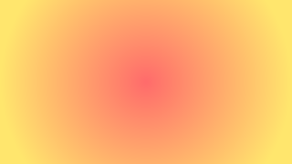
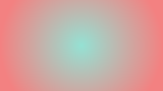
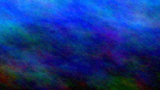
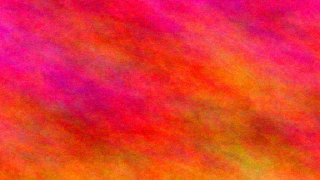
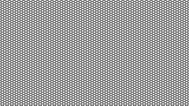
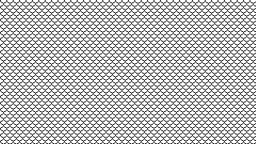
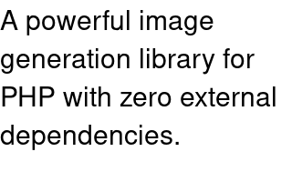

# Example images and generation arguments

This file lists the arguments used to generate each example image with QuickMagick.

## solid_color.png
Solid color canvas - A simple teal blue background

<table><tr><td style="width: 400px;">Preview</td><td>Generation</td></tr>
<tr><td style="width: 400px;"></td><td style="width: 420px;"><pre><code class="language-php">QuickMagick::createImageFile(&#10;    filePath: __DIR__ . '/img/solid_color.png',&#10;    width: 320,&#10;    height: 180,&#10;    category: Category::SOLID_COLOR,&#10;    word: '#2E86AB',&#10;    format: Format::PNG&#10;);</code></pre></td></tr></table>

## linear_gradient_purple.png
Linear gradient - Purple to indigo vertical transition

<table><tr><td style="width: 400px;">Preview</td><td>Generation</td></tr>
<tr><td style="width: 400px;"></td><td style="width: 420px;"><pre><code class="language-php">QuickMagick::createImageFile(&#10;    filePath: __DIR__ . '/img/linear_gradient_purple.png',&#10;    width: 320,&#10;    height: 180,&#10;    category: Category::LINEAR_GRADIENT,&#10;    word: '#667EEA-#764BA2',&#10;    format: Format::PNG&#10;);</code></pre></td></tr></table>

## linear_gradient_pink.png
Linear gradient - Pink to coral vertical transition

<table><tr><td style="width: 400px;">Preview</td><td>Generation</td></tr>
<tr><td style="width: 400px;"></td><td style="width: 420px;"><pre><code class="language-php">QuickMagick::createImageFile(&#10;    filePath: __DIR__ . '/img/linear_gradient_pink.png',&#10;    width: 320,&#10;    height: 180,&#10;    category: Category::LINEAR_GRADIENT,&#10;    word: '#F093FB-#F5576C',&#10;    format: Format::PNG&#10;);</code></pre></td></tr></table>

## linear_gradient_cyan.png
Linear gradient - Sky blue to cyan vertical transition

<table><tr><td style="width: 400px;">Preview</td><td>Generation</td></tr>
<tr><td style="width: 400px;"></td><td style="width: 420px;"><pre><code class="language-php">QuickMagick::createImageFile(&#10;    filePath: __DIR__ . '/img/linear_gradient_cyan.png',&#10;    width: 320,&#10;    height: 180,&#10;    category: Category::LINEAR_GRADIENT,&#10;    word: '#4FACFE-#00F2FE',&#10;    format: Format::PNG&#10;);</code></pre></td></tr></table>

## radial_gradient_sunset.png
Radial gradient - Red to golden yellow circular transition

<table><tr><td style="width: 400px;">Preview</td><td>Generation</td></tr>
<tr><td style="width: 400px;"></td><td style="width: 420px;"><pre><code class="language-php">QuickMagick::createImageFile(&#10;    filePath: __DIR__ . '/img/radial_gradient_sunset.png',&#10;    width: 320,&#10;    height: 180,&#10;    category: Category::RADIAL_GRADIENT,&#10;    word: '#FF6B6B-#FFE66D',&#10;    format: Format::PNG&#10;);</code></pre></td></tr></table>

## radial_gradient_peachy.png
Radial gradient - Mint to peachy circular transition

<table><tr><td style="width: 400px;">Preview</td><td>Generation</td></tr>
<tr><td style="width: 400px;"></td><td style="width: 420px;"><pre><code class="language-php">QuickMagick::createImageFile(&#10;    filePath: __DIR__ . '/img/radial_gradient_peachy.png',&#10;    width: 320,&#10;    height: 180,&#10;    category: Category::RADIAL_GRADIENT,&#10;    word: '#95E1D3-#F38181',&#10;    format: Format::PNG&#10;);</code></pre></td></tr></table>

## plasma_electric_blue.png
Plasma effect - Electric blue fractal pattern

<table><tr><td style="width: 400px;">Preview</td><td>Generation</td></tr>
<tr><td style="width: 400px;"></td><td style="width: 420px;"><pre><code class="language-php">QuickMagick::createImageFile(&#10;    filePath: __DIR__ . '/img/plasma_electric_blue.png',&#10;    width: 320,&#10;    height: 180,&#10;    category: Category::PLASMA,&#10;    word: '#0061FF',&#10;    format: Format::PNG&#10;);</code></pre></td></tr></table>

## plasma_vibrant.png
Plasma effect - Bold magenta to orange fractal

<table><tr><td style="width: 400px;">Preview</td><td>Generation</td></tr>
<tr><td style="width: 400px;"></td><td style="width: 420px;"><pre><code class="language-php">QuickMagick::createImageFile(&#10;    filePath: __DIR__ . '/img/plasma_vibrant.png',&#10;    width: 320,&#10;    height: 180,&#10;    category: Category::PLASMA,&#10;    word: '#FF006E-#FB5607',&#10;    format: Format::PNG&#10;);</code></pre></td></tr></table>

## pattern_crosshatch.png
Pattern - Crosshatch texture

<table><tr><td style="width: 400px;">Preview</td><td>Generation</td></tr>
<tr><td style="width: 400px;"></td><td style="width: 420px;"><pre><code class="language-php">QuickMagick::createImageFile(&#10;    filePath: __DIR__ . '/img/pattern_crosshatch.png',&#10;    width: 320,&#10;    height: 180,&#10;    category: Category::PATTERN,&#10;    word: 'CROSSHATCH30',&#10;    format: Format::PNG&#10;);</code></pre></td></tr></table>

## pattern_fishscales.png
Pattern - Small fish scales texture

<table><tr><td style="width: 400px;">Preview</td><td>Generation</td></tr>
<tr><td style="width: 400px;"></td><td style="width: 420px;"><pre><code class="language-php">QuickMagick::createImageFile(&#10;    filePath: __DIR__ . '/img/pattern_fishscales.png',&#10;    width: 320,&#10;    height: 180,&#10;    category: Category::PATTERN,&#10;    word: 'SMALLFISHSCALES',&#10;    format: Format::PNG&#10;);</code></pre></td></tr></table>

## label_text.png
Label - Simple text rendering on solid background

<table><tr><td style="width: 400px;">Preview</td><td>Generation</td></tr>
<tr><td style="width: 400px;"></td><td style="width: 420px;"><pre><code class="language-php">QuickMagick::createImageFile(&#10;    filePath: __DIR__ . '/img/label_text.png',&#10;    width: 320,&#10;    height: 120,&#10;    category: Category::LABEL,&#10;    word: 'QuickMagick',&#10;    format: Format::PNG&#10;);</code></pre></td></tr></table>

## caption_text.png
Caption - Auto-wrapped multi-line text

<table><tr><td style="width: 400px;">Preview</td><td>Generation</td></tr>
<tr><td style="width: 400px;"></td><td style="width: 420px;"><pre><code class="language-php">QuickMagick::createImageFile(&#10;    filePath: __DIR__ . '/img/caption_text.png',&#10;    width: 320,&#10;    height: 200,&#10;    category: Category::CAPTION,&#10;    word: 'A powerful image generation library for PHP with zero external dependencies.',&#10;    format: Format::PNG&#10;);</code></pre></td></tr></table>
